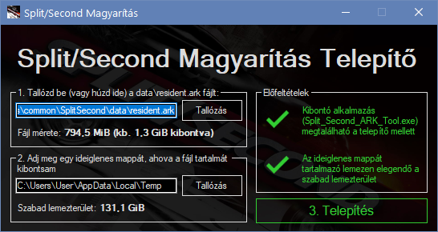

# Split/Second PC Magyarítás Telepítő

## Mit tud

Ha Windows-on keresztül megfelelően telepítve van a játék, akkor automatikusan megpróbálja megkeresni magának a szükséges `resident.ark` fájlt tallózás nélkül, de a magyarítás telepítése előtt van lehetőség tetszőleges fájlt és ideiglenes mappát megadni (ha pl. nincs a kibontáshoz elég szabad hely a `C:` meghajtódon).

Ebben a repository-ban található meg a konkrét fordítás fájl is a [res/huLangFile.txt](res/huLangFile.txt) útvonalon. Ebben a fájlban ez ékezetes Ő és Ű betűk közvetlen szerepelnek, de mivel a játék 2 betűtípúsából csak az egyik támogajta ezen karakterek kis- és nagybetűs verzióit ezért a telepítő a folyamat során ezeket Ô és Û betűkre cseréli.

## Használati útmutató

 1. Töltsd le a [SplitSecondMagyaritas.exe] fájlt egy tetszőleges mappába
 2. Szerezd be a `Split_Second_ARK_Tool_By_Delutto.7z`-t innen: https://zenhax.com/viewtopic.php?t=589
 3. [7-Zip] segítségével csomagold ki az előbb letöltött állományból a `Split_Second_ARK_Tool.exe`-t **közvetlen a `SplitSecondMagyaritas.exe` fájl mellé**
 4. Indítsd el a telepítőt és kövesd a képernyőn megjelenő utasításokat
 
    - Ha a Windows SmartScreen nyavajog, hogy ismeretlen kiadótól származik a program, az ablakban a “További információ” linkre kattintva megjelenik egy gomb amivel már tudod futtatni.

## Külön köszönet

 * cockafej-nek a [ps-hack.hu] Discord szerveréről a magyarított betűtípusokért

## Nem működik / hibát találtam

Bármilyen észrevétellel a [weboldalamon] található eléhetőségeim egyikén kereshetsz.

 [SplitSecondMagyaritas.exe]: https://bitbucket.org/DJDavid98/split-second-magyaritas/downloads/SplitSecondMagyaritas.exe
 [7-Zip]: https://www.7-zip.org/
 [weboldalamon]: https://djdavid98.art
 [ps-hack.hu]: http://ps-hack.hu
